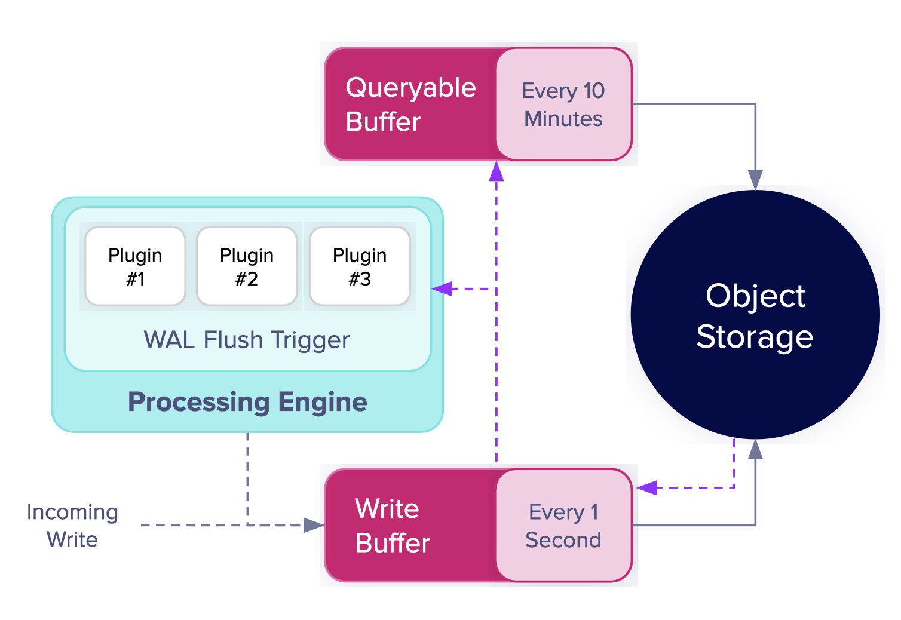
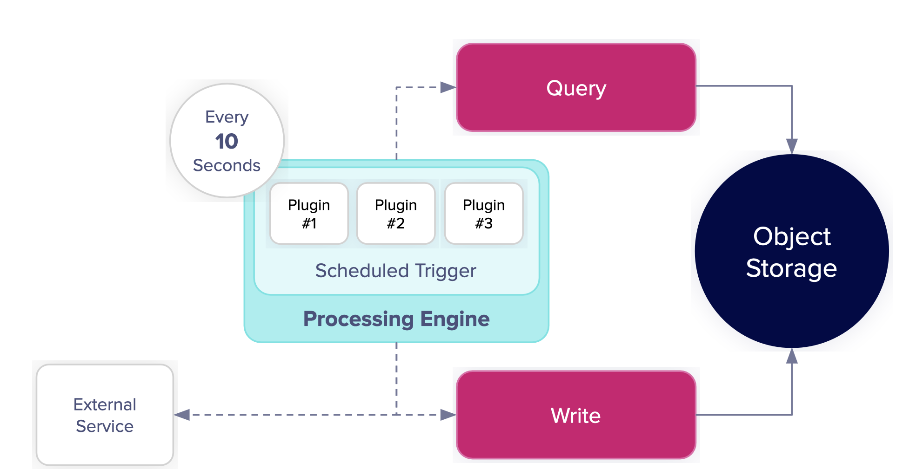
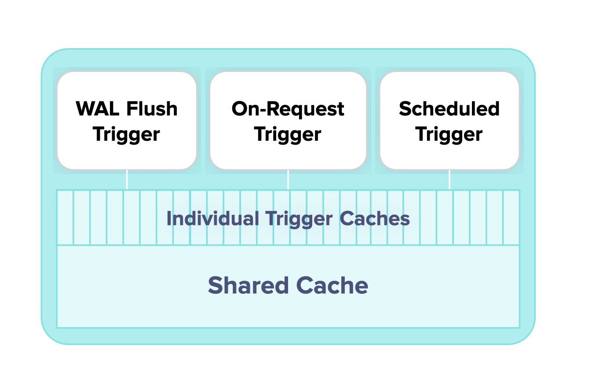

# Processing Engine Training

This guide provides a foundational training of the InfluxDB 3 Processing Engine that can be done by yourself. Refer to the [official documentation](https://docs.influxdata.com) and the community plugins [repository](https://github.com/influxdata/influxdb3_plugins) to discover more advanced use cases and capabilities.

### Pre-Requisites:

1. **Python**: Make sure you have Python version 3.x on your system.
2. **Code Editor**: Your favorite code editor.
3. **Install InfluxDB 3**: Either InfluxDB 3 Core or Enterprise.
   - You can install it as a `Docker Image` or directly using `Simple Download` option.
   - When promoted **Start InfluxDB Now? Type 'n'** as we will start it later.

   InfluxDB 3 Core
   ```shell
   curl -O https://www.influxdata.com/d/install_influxdb3.sh && sh install_influxdb3.sh
   ```
   InfluxDB 3 Enterprise
   ```shell
   curl -O https://www.influxdata.com/d/install_influxdb3.sh && sh install_influxdb3.sh enterprise
   ```
4. **Verify installation**: Open terminal window and run `influxdb3 --version` command without error to the latest version installed successfully.

## Processing Engine

It is an embedded Python VM that runs inside your InfluxDB 3 database and lets you:
- Process data as it’s written to the database.
- Run code on a schedule.
- Create API endpoints that execute Python code.
- Maintain state between executions with an in-memory cache.

### Plugins & Triggers

- **Plugins**: Python scripts executed by InfluxDB, containing callback functions defined for specific tasks.

- **Triggers**: Mechanisms that activate plugins based on specific conditions or schedules.
   - Configure triggers with arguments (--trigger-arguments) to control plugin behavior.
   - Multiple triggers can run plugins simultaneously, synchronously or asynchronously.

### Workflow

```text
+-----------------+
|   Data Source   |
| (Telegraf, CSV, |
|  CLI, API etc)  |
+-----------------+
         |
         | Write Data
         V
+-----------------+
|   InfluxDB 3    |
| Core/Enterprise |
+-----------------+
         |
         | WAL Flush
         V
+-----------------+       +-----------------+
|  Set Trigger(s) |------>| Executes Plugin |
| (Data Write,    |       |  (Python Code)  |
|  Scheduled,     |       |                 |
|  HTTP Request)  |       |                 |
+-----------------+       +-----------------+
         |                |       |
         |                |       |  Read/Write via API
         |                |       V
         |                | +-----------------+
         |                | |  InfluxDB 3     |
         |                | |  Data Storage   |
         |                | | (Tables, etc.)  |
         |                | +-----------------+
         |                |       |
         |                |       |  Optional APIs
         |                |       V
         |                | +---------------------------------------+
         |                | |In-Memory Cache, Write, Query, Log etc |
         |                | |                                       |
         |                | +---------------------------------------+
         +----------------+
```
### Setup

To enable the Processing Engine, you need to tell InfluxDB where to find your Python plugin files. Use the `--plugin-dir` option when starting the server.

1. Create a plugin directory anywhere you prefer as this is where plugin code will reside. Optionally, you also reference plugin from a GitHub repository in which case you can omit directory creation and start InfluxDB 3 without providing it plugin folder path.
   
```shell
cd ~
mkdir influxdb3-plugins
```

2. Stop and Start InfluxDB 3 with Plugin Support if using plugins from local directory


2.1 Start InfluxDB with Processing Engine

Arguments:

- `--node-id`: Identifier for your InfluxDB node.
- `--object-store`: Type of object storage (e.g., memory, file, remote such as Amazon S3).
- `--data-dir`: Location of the directory where file baed object storage will reside.
- `--plugin-dir`: Directory containing local Python plugin scripts. Omit this argument if using plugins directly from GitHub.

**Example command**
```shell
influxdb3 serve \
  --node-id node0 \
  --object-store file \
  --data-dir ~/.influxdb/data
  --plugin-dir ~/influxdb3-plugins
```
Upon running hte command, InfluxDB 3 should start on localhost:8181 (default) and start printing logs in the terminal window without any error.

3. Create a Token using the CLI

Most `influxdb3` commands require an authentication token. Create an admin token using the following command and save it somewhere securely:
```shell
influxdb3 create token --admin
```

> [!IMPORTANT]
> Remember, tokens give full access to InfluxDB. It is recommended to secure your token string as it is not saved within the database thus can't be retreived if lost. You can save it as a local **INFLUXDB3_AUTH_TOKEN** enviornment variable or in a keystore.

4. Create Database & Verfify it using the cli. It can also be created automatically when line protocol data is first written to it.
```shell
influxdb3 create database my_awesome_db --token "YOUR_TOKEN_STRING"
influxdb3 show databases --token "YOUR_TOKEN_STRING"
```

5. Write Data using the CLI
```shell
influxdb3 write \
  --database my_awesome_db \
  --token YOUR_TOKEN_STRING \
  --precision ns \
  'cpu,host=server01,region=us-west value=0.64 1641024000000000000'
```

6. Query Data using the CLI
```shell
influxdb3 query \
  --database my_awesome_db \
  --token YOUR_TOKEN_STRING \
  "SELECT * FROM cpu"
``` 

### Plugin & Triggers

A plugin is a Python file containing a callback function with a specific signature that corresponds to the trigger type. The trigger defines and configures the plugin including providing any optional information using `--trigger-arguments` option. One or more trigger can be setup to run simultaneously either synchnorously (default behavior) or asynchnorously. Triggers can also be disabled or deleted.

#### Install Python dependencies (optional)

InfluxDB 3 provides a virtual enviornment for running python processing engine plugins. Those plugins are often dependent on python packages such as those from PyPy. They can be installed using influxdb3 cli for example `influxdb3 install package pandas --token YOUR_TOKEN_STRING` to install pandas package.

**There are three main trigger types**:

#### 1. WAL-Flush

This trigger executes your plugin whenever data is written to specified tables and the Write-Ahead Log (WAL) is flushed to the object store (typically every second). Common use cases are: Real time data transformation, validation, threshold based alerting etc.



1.1 Create a plugin for WAL-Flush trigger. 

**Create Python script 'hello-wal.py' in your plugins directory that you provided the path for when starting InfluxDB 3.**

```shell
cd ~/influxdb3-plugins
touch hello-wal.py
```
Open code editor and add the following sample code, also available [here](hello-wal.py).

```python
import datetime
"""
Entry point for WAL flush triggers that does basic data processing and it to a new table.
Arguments: influxdb3_local (API object), table_batches (data written), args (optional trigger arguments).
"""
def process_writes(influxdb3_local, table_batches, args=None):
    # Log that the plugin was triggered
    influxdb3_local.info("Processing data with enhanced WAL plugin!")
    
    # Process each table's data
    for table_batch in table_batches:
        table_name = table_batch["table_name"]
        rows = table_batch["rows"]
        
        # Skip processing our own output table to avoid recursion
        if table_name == "data_insights":
            continue
            
        # Log information about the data
        influxdb3_local.info(f"Processing {len(rows)} rows from table {table_name}")
        
        # Calculate some basic statistics if we have numeric fields
        total_values = 0
        max_value = float('-inf')
        min_value = float('inf')
        has_numeric = False
        
        for row in rows:
            # Look for numeric fields we can analyze
            for field_name, value in row.items():
                if isinstance(value, (int, float)) and field_name != "time":
                    has_numeric = True
                    total_values += value
                    max_value = max(max_value, value)
                    min_value = min(min_value, value)
        
        # Write insights to a dedicated table
        line = LineBuilder("data_insights")
        line.tag("source_table", table_name)
        line.int64_field("row_count", len(rows))
        
        # Add statistics if we found numeric values
        if has_numeric:
            line.float64_field("max_value", max_value)
            line.float64_field("min_value", min_value)
            if len(rows) > 0:
                line.float64_field("avg_value", total_values / len(rows))
        
        # Add a timestamp field showing when this processing occurred
        line.string_field("processed_at", datetime.datetime.utcnow().isoformat())
        
        # Write the insights back to the database
        influxdb3_local.write(line)
        
        # Log completion
        influxdb3_local.info(f"Generated insights for {table_name}")
```

1.2 Create a WAL-Flush trigger that runs when data is written to any table. This simple plugin, processed the data and saves that in a new table in the same database.

Arguments:
- `--trigger-spec`: Specifies for which table the trigger activates (e.g. specific table or on all tables).
- `--plugin-filename`: Name of the Python plugin file.
- `--database`: Database to use.
- '--token': YOUR_TOKEN_STRING
- `NAME_OF_TRIGGER`

```shell
influxdb3 create trigger \
  --trigger-spec "all_tables" \
  --plugin-filename "hello-wal.py" \
  --database my_awesome_db \
  --token YOUR_TOKEN_STRING
  hello_wal_trigger 
```

1.3 Test WAL-Flush plugin

Run the following command to write sample data.
```shell
influxdb3 write \
  --database my_awesome_db \
  --token YOUR_TOKEN_STRING \
  'cpu,cpu=cpu0,host=server01 usage_idle=65.7,usage_user=25.3,usage_system=8.2,usage_iowait=0.8
   cpu,cpu=cpu1,host=server01 usage_idle=70.1,usage_user=20.5,usage_system=8.6,usage_iowait=0.8'
```

Verify the following:

- **InfluxDB Server Logs**: You should see the "Hello from WAL plugin!" message, and a message indicating the number of rows processed
- **Table - data_insights **: Query the newly created 'data_insights' table in your database to see the processed data.

```shell
influxdb3 query \
  --database my_awesome_db \
  --token YOUR_TOKEN_STRING \
  "SELECT *, tz(time, 'America/Los_Angeles') AS local_time FROM data_insights" 
```

#### 2. Schedule plugin

Scheule plugin runs at a given schedule defined in the `trigger-spec`. Common use cases are: Periodic data aggregation, Deadman alert, Health monitoring, Scheduled reporting etc.



2.1 Create a plugin for WAL-Flush trigger. [Sample file](hello-schedule.py)
```python
"""
Entry point for scheduled triggers that is called based on defined schedule. It logs a message and writes to the scheduler_heartbeat table.
Arguments: influxdb3_local (API object), call_time (trigger time), args (optional trigger arguments).
"""
def process_scheduled_call(influxdb3_local, call_time, args=None):
    # Log that the plugin was triggered
    influxdb3_local.info(f"Hello from scheduled plugin! Called at {call_time}")
    
    # Log a dummy alert
    influxdb3_local.info("ALERT: This is a dummy alert from the scheduler plugin!")
    
    # Query some data
    results = influxdb3_local.query("SELECT count(*) FROM data_insights")
    
    # Write a heartbeat record
    line = LineBuilder("scheduler_heartbeat")
    line.tag("source", "schedule_plugin")
    line.string_field("status", "running")
    line.string_field("alert_type", "dummy_alert")
    
    influxdb3_local.write(line)
```

2.2 Create a Schedule trigger that runs on any particular schedule.

Arguments:
- `--trigger-spec`: Specifies how often trigger activates (e.g. Run every minute, you can use cron syntax too).
- `--plugin-filename`: Name of the Python plugin file.
- `--database`: Database to use.
- '--token': YOUR_TOKEN_STRING
- `NAME_OF_TRIGGER`
  
```shell
influxdb3 create trigger \
  --trigger-spec "every:10s" \
  --plugin-filename "hello-schedule.py" \
  --database my_awesome_db \
  --token YOUR_TOKEN_STRING \
  hello_schedule_trigger
```

2.3 Test the plugin

Run the following command to query test data written to the new data at given interval.

```shell
influxdb3 query \
  --database my_awesome_db \
  --token YOUR_TOKEN_STRING \
  --language sql \
  "SELECT *, tz(time, 'America/Los_Angeles') AS local_time FROM scheduler_heartbeat ORDER BY time DESC LIMIT 10"
```
Verify the new records were added at the given schedule (e.g. 10 seconds).

#### 3. HTTP Request plugin

You can create custom endpoint to respond to HTTP Requests coming from the web. Common use cases are creating webhook, On-demand processing, custom API to handle web interactions over GET/POST and returns any particual format to the client.

3.1 Create a plugin to handle HTTP requests. [Sample file](hello-http.py)
```python
"""
Entry point for HTTP request triggers that is called when requests hit custom endpoint.
Arguments: influxdb3_local (API), query_parameters, request_headers, request_body, args (optional).
Returns response object to the client.
"""
def process_request(influxdb3_local, query_parameters, request_headers, request_body, args=None):
    # Log that the plugin was triggered
    influxdb3_local.info("Hello from HTTP plugin!")
    
    # Log request details
    influxdb3_local.info(f"Query parameters: {query_parameters}")
    
    # Write a record of the request
    line = LineBuilder("api_requests")
    line.tag("endpoint", "hello")
    line.int64_field("received", 1)
    influxdb3_local.write(line)
    
    # Return a response (automatically converted to JSON)
    return {
        "message": "Hello from InfluxDB 3 Processing Engine!",
        "timestamp": influxdb3_local.query("SELECT now()")[0]["now"]
    }
```

3.2 Create a HTTP trigger that responds to HTTP requests such as a webhook.

Arguments:
- `--trigger-spec`: Specifies the API endpoint path for the HTTP request (e.g. request:hello => api/v3/engine/hello).
- `--plugin-filename`: Name of the Python plugin file.
- `--database`: Database to use.
- '--token': YOUR_TOKEN_STRING
- `NAME_OF_TRIGGER`
  
```shell
# Create a trigger that responds to HTTP requests
influxdb3 create trigger \
  --trigger-spec "request:hello" \
  --plugin-filename "hello-http.py" \
  --database my_awesome_db \
  --token YOUR_TOKEN_STRING \
  hello_http_trigger
```

3.3 Test the HTTP Request plugin

Send a GET or POST request to your custom endpoint such as http://localhost:8181/api/v3/engine/webhook to see a JSON response back from the plugin.

Example POST Request
```shell
 curl http://localhost:8181/api/v3/engine/hello \
  -X POST \
  -H "Content-Type: application/json" \
  -H "Authorization: Bearer YOUR_TOKEN_STRING" \
  -d '{"message": "Hello from webhook!"}'
```
Run the followign SQL query to confirm, plugin wrote data to the new table `api_requests`.

```shell
influxdb3 query \
  --database my_awesome_db \
  --token YOUR_TOKEN_STRING \
  "SELECT * FROM api_requests ORDER BY time DESC LIMIT 10"
```

### Extending Plugin with APIs

Extend your plugin's fuctionality using Python APIs:

- Writing Data: Use influxdb3_local.write(line_protocol_string) or the LineBuilder class.
- Querying Data: Use influxdb3_local.query(sql_query, params=None).
- Logging: Use influxdb3_local.info(), influxdb3_local.warn(), and influxdb3_local.error() for logging messages.
- In-Memory Cache: Use influxdb3_local.cache to store and retrieve data between plugin executions. There are two types of cache available individual trigger cache and shared trigger cache.



4.  Stop InfluxDB3

Last step is to stop InfluxDB3 if you'd like. If InfluxDB 3 is running in the foreground, you can usually stop it by pressing `Ctrl+C` otherwise in a new terminal window execute the following commands to find and kill the InfluxDB 3 server:
```shell
ps aux | grep influxdb3
kill -9 <PID>
```

### Using Community created Plugin

You can directly use plugins from the official [InfluxData Plugins GitHub repository](https://github.com/influxdata/influxdb3_plugins) or other public repositories using the gh: prefix in the `--plugin-filename argument` 

Example - using sample system_metrics schedule plugin
```shell
influxdb3 create trigger \
  --trigger-spec "every:1m" \
  --plugin-filename "gh:examples/schedule/system_metrics/system_metrics.py" \
  --database my_awesome_db \
  system_metrics
```

### Get Involved and Contribute!

We encourage you to contribute to the InfluxDB community and help make the Processing Engine even better!

- **Report Issues**: If you encounter any problems or have questions, please open an issue on the GitHub repository.
- **Share Your Plugins**: Create your own InfluxDB 3 plugins and share them with the community by contributing to the InfluxData Plugins Repository.
- **Join the Community**: Connect with other InfluxDB users and developers through our community channels on [Discord](https://discord.com/invite/vZe2w2Ds8B), [Slack](https://influxdata.com/slack) and website [forum](https://community.influxdata.com)
- **Star the Repository**: If you found this valuable, please star this repository.

